# Roundabout

[](https://pypi.org/project/roundabout/)
[](https://github.com/erinyoung/roundabout/actions/workflows/ci.yml)

**A pipeline for plasmid outbreak clustering and visualization.**

Tracking the spread of antimicrobial resistance (AMR) and virulence factors during outbreaks is a massive public health challenge. While traditional genomic epidemiology excels at tracing bacterial clones via chromosomal mutations (like SNP calling), it fundamentally struggles to track the highly mobile plasmids responsible for horizontal gene transfer (HGT). Because plasmids frequently recombine, fuse, and transfer across completely different bacterial species, they are notoriously difficult to properly cluster, align, and analyze. 

**Roundabout** solves this problem by providing an automated, end-to-end pipeline tailored specifically for mobile genetic elements. It takes plasmid assemblies and annotates their features, clusters them based on structural similarity and replicon profiles, compares them to RefSeq plamid databases, and generates comparative visualizations.

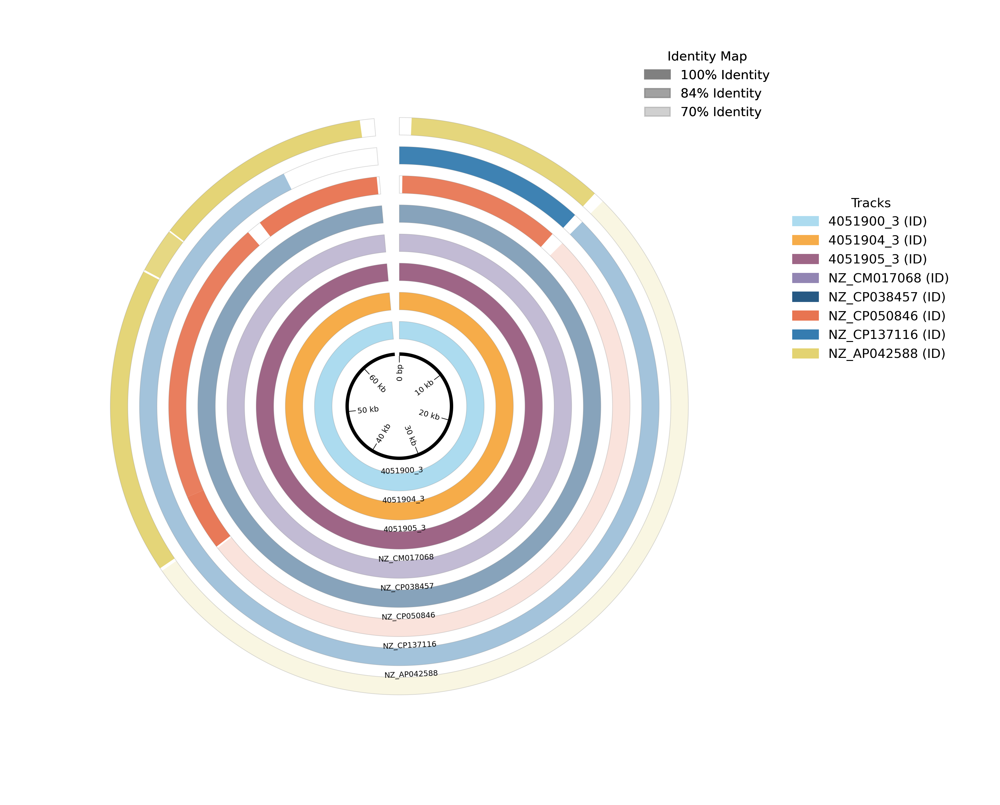

## Quickstart

Before running the full annotation pipeline for the first time, download and configure the required databases. 

```bash
# Download and configure all default databases
roundabout --setup-db
```
Once the databases are configured, run the pipeline by pointing it to a directory containing your plasmid FASTA files (.fa, .fasta, or .fna).

```bash
# Run the full pipeline using 8 threads
roundabout -f path/to/fasta_directory -o roundabout_results -t 8
```

Cluster and visualize plasmids based solely on structural similarity:

```bash
# Run structural clustering and local visualizations only (No databases)
roundabout -f path/to/fasta_directory -o roundabout_results --skip-db
```

A full list of cli options can be accessed via standard help flags (`-h`, `--help`):
```bash
# A full list of cli options can be found with the "-h" flag
roundabout -h
```

## Installation

Because Roundabout relies on heavily optimized, non-Python bioinformatics binaries (like BLAST, KMA, and Skani), using **Conda** (or Mamba) to manage the environment is strongly recommended. 

### Option 1: Bioconda (Recommended)
The easiest way to install Roundabout and all of its required external dependencies is through the Bioconda channel. This creates an isolated environment and installs everything in one step.

```bash
# Create a new environment and install roundabout
conda create -n roundabout-env -c conda-forge -c bioconda roundabout

# Activate the environment
conda activate roundabout-env
```

### Option 2: Install from Source (Development)
Roundabout can be installed from source by cloning the repository.

```bash
# Clone the repository
git clone https://github.com/erinyoung/roundabout.git
cd roundabout

# Create the environment from the YAML file
conda env create -f environment.yml

# Activate the environment
conda activate roundabout-env
```

### Post-Installation Database Setup
Regardless of how Roundabout was installed, download the necessary reference databases before running. These databases are for [Bakta](https://github.com/oschwengers/bakta), [Plasmidfinder](https://github.com/genomicepidemiology/plasmidfinder), [refseq-plasmid-dl](https://github.com/erinyoung/refseq-plasmid-dl), and [AMRFinder](https://github.com/ncbi/amr) can be very large, but also very useful.

```bash
roundabout --setup-db
```

## Dependencies

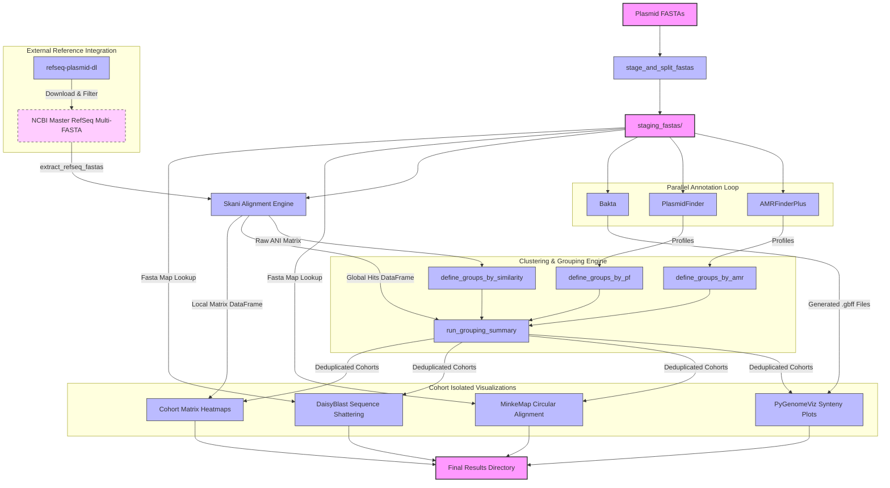

Roundabout integrates several open-source bioinformatics tools to handle everything from annotation to alignment and visualization. 

### Core Annotation & Clustering
* **[Bakta](https://github.com/oschwengers/bakta):** Rapid and standardized structural and functional annotation of plasmid sequences.
* **[AMRFinderPlus](https://github.com/ncbi/amr):** Detection of antimicrobial resistance (AMR) genes, stress responses, and virulence factors.
* **[PlasmidFinder](https://github.com/genomicepidemiology/plasmidfinder):** Identification of plasmid replicon types (Incompatibility/Inc groups) to establish plasmid lineages.
* **[Skani](https://github.com/bluenote-1577/skani):** High-speed calculation of Average Nucleotide Identity (ANI) and alignment fractions for defining structural similarity cohorts.
* **[refseq-plasmid-dl](https://github.com/erinyoung/refseq-plasmid-dl):** Downloading, filtering, and curating circular reference plasmids from NCBI RefSeq to provide global outbreak context.

### Visualization Ecosystem
* **[pyGenomeViz](https://github.com/moshi4/pyGenomeViz):** Generating linear synteny plots and comparing annotated genomic regions across plasmid cohorts.
* **[MinkeMap](https://github.com/erinyoung/MinkeMap/):** Creating detailed circular alignment plots to visualize coverage and structural conservation against reference sequences.
* **[DaisyBlast](https://github.com/erinyoung/daisyblast):** Performing self-BLAST sequence shattering, feature grouping, and generating structural dotplots.

### Alignment Engines & Backend
* **[BLAST](https://www.ncbi.nlm.nih.gov/books/NBK569856/), [MUMmer](https://github.com/mummer4/mummer), [MMseqs2](https://github.com/soedinglab/mmseqs2), & [progressiveMauve](https://darlinglab.org/mauve/user-guide/progressivemauve.html):** The underlying computational alignment engines powering the structural synteny visualizations and sequence shattering.
* **[KMA](https://bitbucket.org/genomicepidemiology/kma):** The high-speed k-mer alignment engine required for indexing and searching the PlasmidFinder database.
* **[Pandas](https://pandas.pydata.org/) & [SciPy](https://scipy.org/):** The data manipulation and scientific computing backends used for matrix generation, parsing outputs, and mathematical threshold filtering.


## Testing the Pipeline

Roundabout comes with a set of sample FASTA files to verify that the pipeline and its dependencies are functioning correctly. These files are located in the `test/` directory.

Use the `--skip-db` flag to run a quick structural clustering test without downloading any databases:

```bash
roundabout -f test/ -o test_results/ --skip-db
```

To test the full annotation and global alignment capabilities, ensure the databases are set up (`roundabout --setup-db`), and run:

```bash
roundabout -f test/ -o test_results/
```
Once the run completes, explore the `test_results/` directory to see the generated similarity matrices, annotation tables, and visual plots.


***

## Example Visualizations

Roundabout automatically generates publication-ready figures for your plasmid cohorts.

**1. PyGenomeViz Linear Synteny Plot**
Visualizes structural rearrangements, inversions, and conserved gene blocks (like AMR genes) across a cohort.
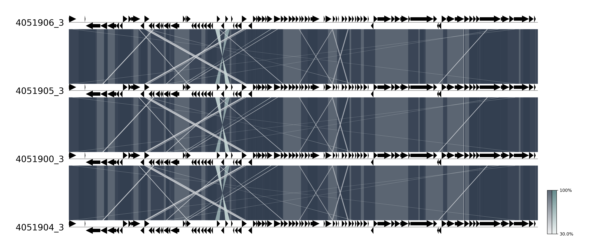

**2. MinkeMap Circular Plot**
Maps sequence tracks against a reference backbone to highlight coverage and structural conservation.


**3. Skani ANI Clustermap**
Separates mixed FASTAs into distinct outbreak clusters based on Average Nucleotide Identity.
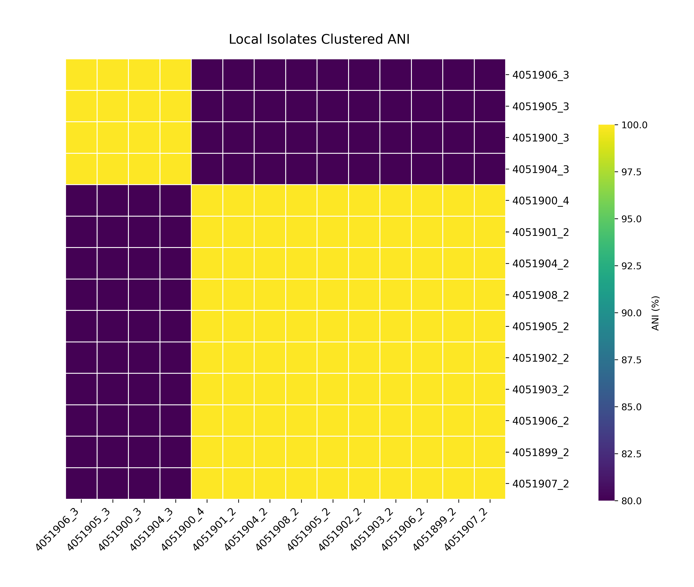

**4. Skani Global Scatter Plot**
Places local isolates into the context of the global NCBI RefSeq database.
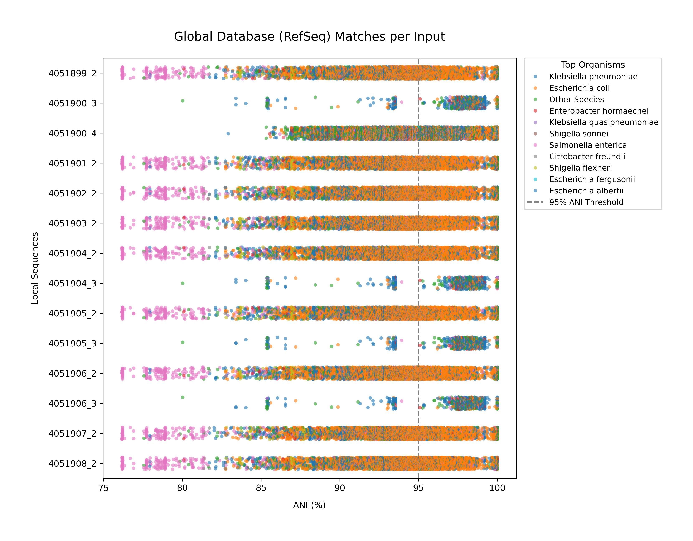


## Understanding the Output

Roundabout generates a structured output directory containing both the raw data and the final comparative visualizations. By default, these are saved in the `results/` directory.

Here is a breakdown of the key output folders and what they contain:

### 1. Staging and Annotations
* **`staging_fastas/`**: Contains the individual, cleaned sequence files. Multi-FASTA inputs are split here before processing.
* **`amrfinder_results/`**: Contains the raw TSV outputs from AMRFinderPlus for each sequence, alongside an `amr_groups.json` file detailing the cohort assignments based on shared resistance profiles.
* **`plasmidfinder_results/`**: Contains the incompatibility/replicon typing results and the `plasmidfinder_groups.json` assignment file.
* **`bakta_results/`**: Contains the comprehensive structural and functional annotations for each sequence, including standard GFF3, GenBank (`.gbff`), and nucleotide/protein FASTA files.

### 2. Clustering and Similarity
* **`skani_results/`**: The core clustering engine outputs. 
  * `skani_matrix.tsv`: The raw pairwise alignment metrics.
  * `local_ani_clustermap.png`: A hierarchical heatmap showing how your local isolates group together.
  * `global_ani_scatter.png`: A scatter plot placing your local isolates into context against the global NCBI RefSeq database.
  * `similarity_groups.json`: The cohort assignments based on your defined ANI and alignment fraction thresholds.

### 3. Cohort-Specific Visualizations
Roundabout processes sequences that group together into isolated cohorts, generating dedicated visualizations for each outbreak cluster.

* **`ani_heatmap_results/`**: Contains isolated, cohort-specific distance heatmaps.
* **`daisyblast_results/`**: Contains the output of the sequence shattering, structural feature grouping, and dotplots for each cohort.

<details>
  <summary>Click to view daisyblast comparison examples</summary>

### DaisyBlast syteny groups in separate visualizations
<p align="center">
  
  
  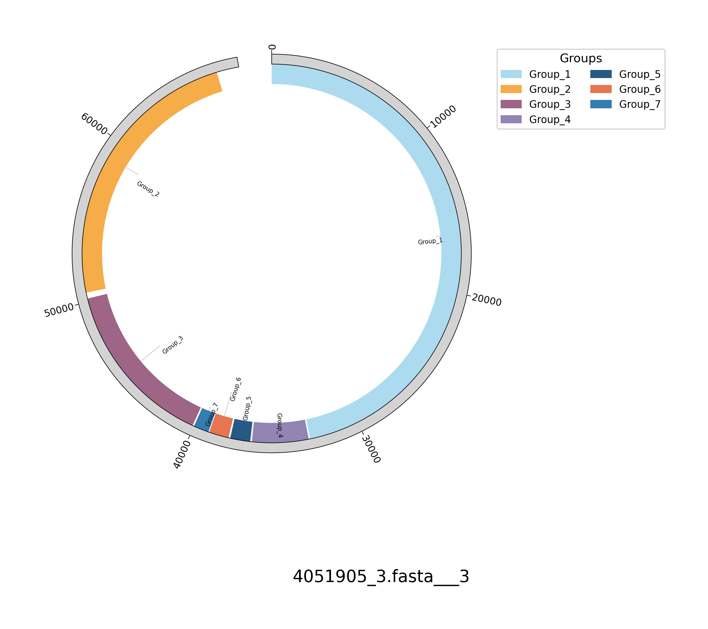
</p>

### DaisyBlast mock blast results

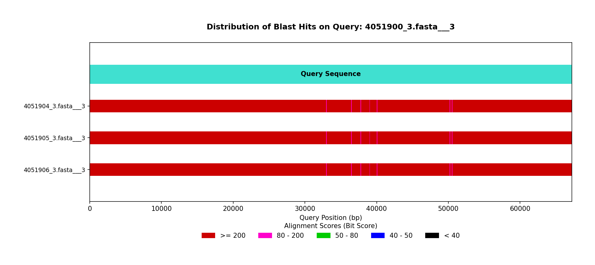

### DaisyBlast generates combined (shown) and separate dot plots

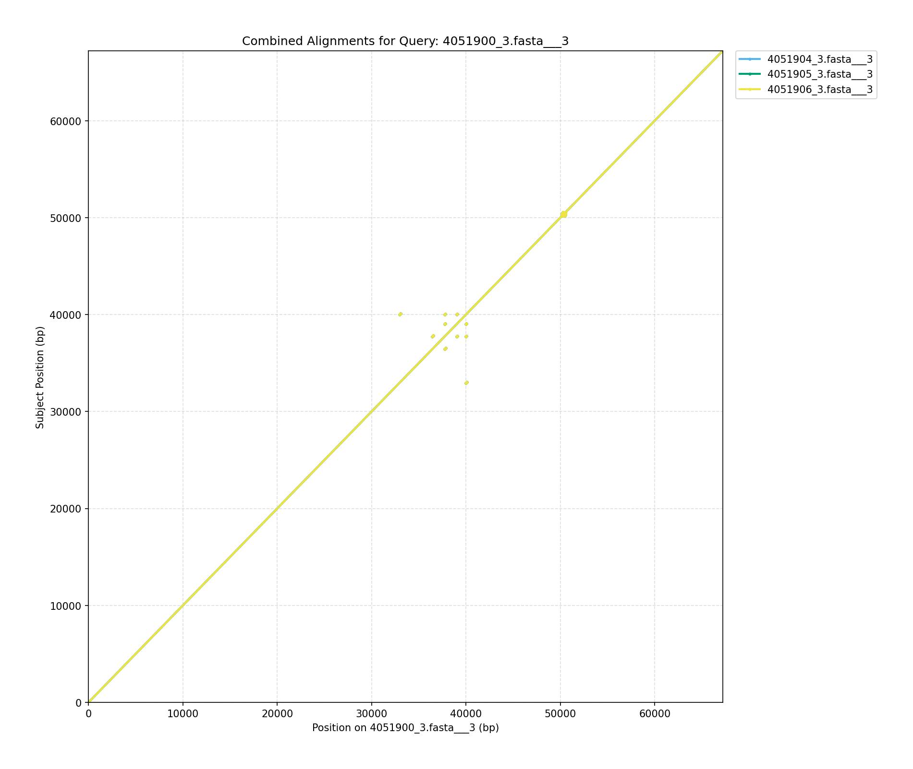

</details>

* **`minkemap_results/`**: Contains circular sequence alignments showing how the cohort maps against a central reference sequence.

* **`pygenomeviz_results/`**: Contains syteny maps from fasta and gbff files created by 

<details>
  <summary>Click to view pygenomeviz comparison examples</summary>

  ### BLAST Comparison (GBFF and FASTA)

  

  

  ### MUMmer Comparison (GBFF and FASTA)
  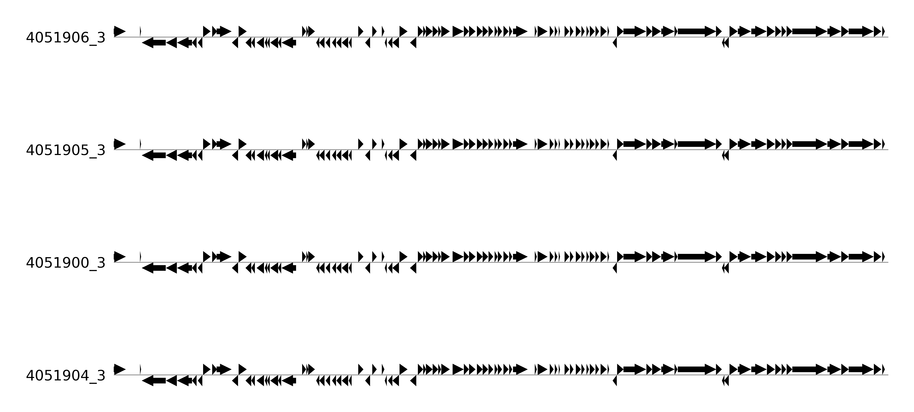
  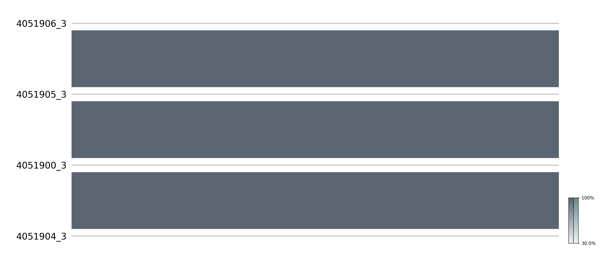

  ### MMSEQS (GBFF only)
  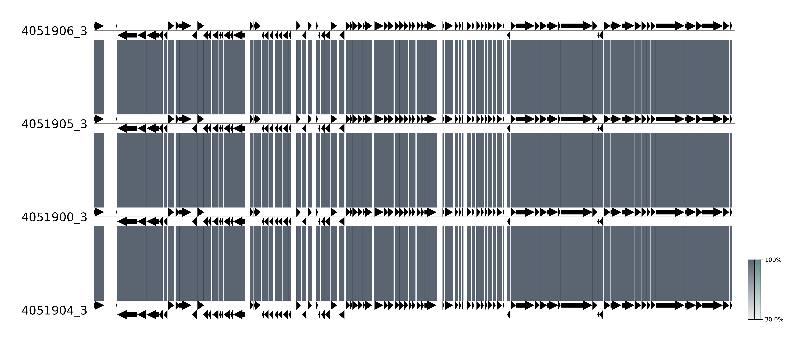

  ### Progressive Mauve (FASTA only)
  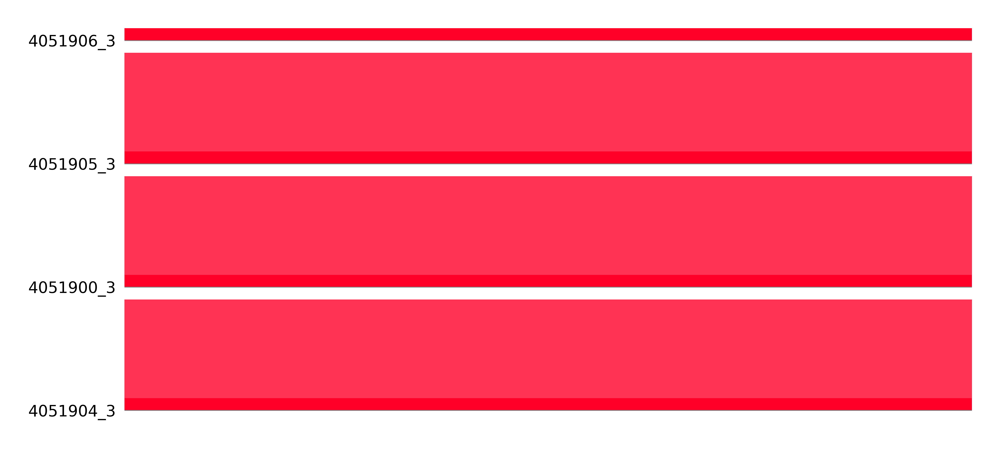
</details>

## Background: From Nextflow to Native Python

Roundabout was originally developed and structured as a [Nextflow](https://www.nextflow.io/) workflow. While Nextflow is an excellent orchestration engine for executing large-scale genomic pipelines across high-performance computing clusters, it ultimately proved to be the wrong architectural fit for this specific project. 

The vast majority of Roundabout's core processing, mathematical clustering, and visualization steps rely on native Python libraries (such as Pandas, SciPy, PyGenomeViz, and custom Python scripts). In a Nextflow environment, passing complex data structures—like Pandas DataFrames or clustering dictionaries—between disparate processes required constantly writing them to disk as intermediate text files and re-parsing them in the next step. This added unnecessary I/O overhead and made the codebase highly fragmented and difficult to maintain.

By converting Roundabout into a standalone, modular Python package, we achieved several major improvements:

* **Simplified Maintenance:** The codebase is now a single, cohesive Python application. Developers no longer have to manage Nextflow DSL alongside disconnected Python scripts.
* **In-Memory Processing:** Dataframes and dictionaries are passed directly between functions via the `engine.py` orchestrator, drastically reducing file I/O operations and speeding up execution.
* **Easier Distribution:** Instead of requiring end-users to install Nextflow, configure execution profiles, and manage container runtimes, users can now install the entire toolchain with a single `conda install` command.
* **Robust Testing:** Moving to a native Python architecture allowed us to implement comprehensive unit and integration testing via `pytest`, ensuring long-term stability and easier open-source contributions.

## AI Collaboration Disclaimer

This project originally began as a Nextflow workflow and was entirely refactored, modernized, and packaged into a native Python library with the collaborative assistance of Gemini, an AI developed by Google. 

AI was utilized as a peer-programming tool to accelerate the conversion of Nextflow processes into modular Python functions, implement structural code optimizations across the orchestrator modules, and design the automated `pytest` and GitHub Actions continuous integration suites. All automated scripts, integration tests, and architecture updates generated during this process were thoroughly reviewed, manually tested, and biologically validated to ensure long-term pipeline stability and accuracy for public health genomic epidemiology.